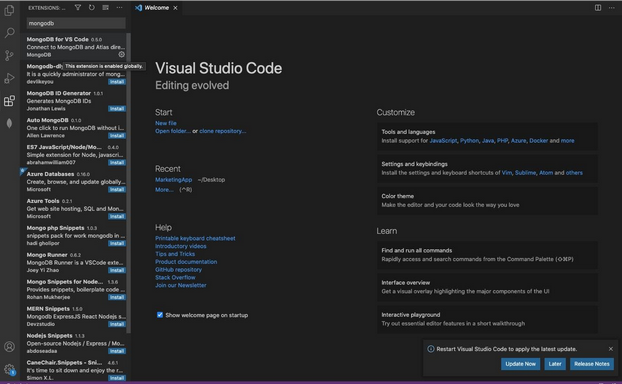
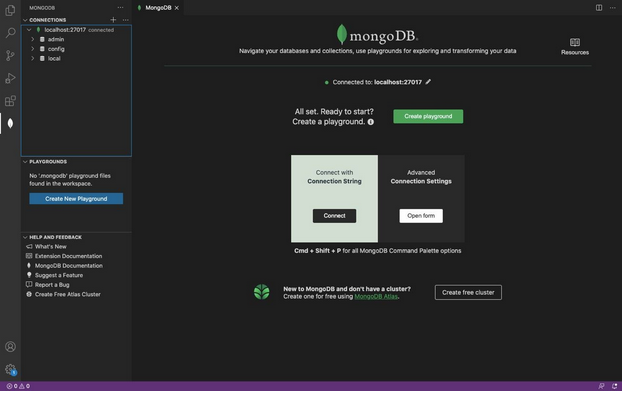
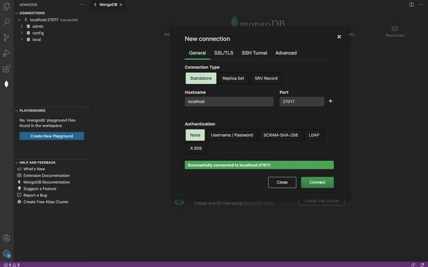
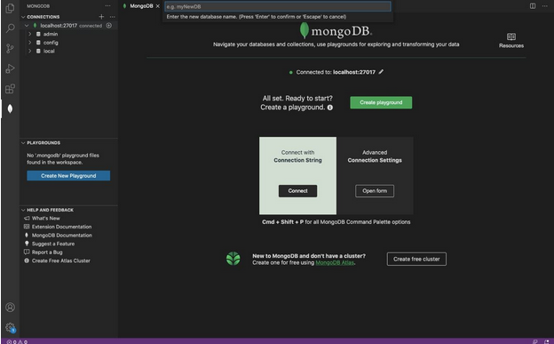
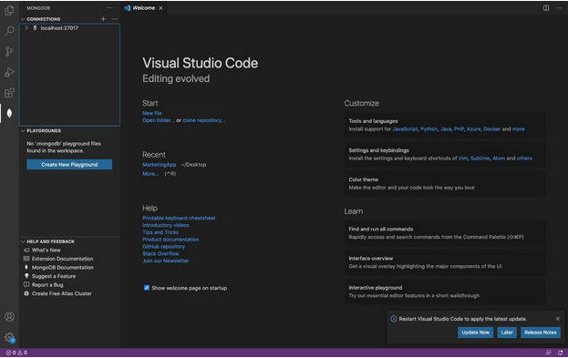

# Install MongoDB on VSCode (Mac OS)

Firstly, we need to install MongoDB in our system. If you’re using Mac OS, enter the following lines of commands in the terminal
```
~% brew tap mongodb/brew
```

Install mongodb community with

```
~% brew install mongodb-community@4.4
```

Now you’ve successfully installed MongoDB in your system. To determine the path of the downloaded files, enter

```
~% brew --prefix
```

You will need to start the service every time you want to access MongoDB
```
~% brew services start mongodb-community@4.4
```

<br/><br/>

Let’s open VS Code to install the MongoDB extension. Select the first option -- *MongoDB for VS Code* <br/>



<br/><br/>

After the installation, click on ‘Add Connection’ and you will be seeing the screen below <br/>



<br/><br/>

Select Open form under the Advanced Connection Settings. You can make your own configuration or stay as default <br/>



<br/><br/>

Now, MongoDB is connected in your VS Code! Under CONNECTIONS, Click on the plus sign beside the localhost:27017 and you will be prompted to enter the new database name as shown in the figure. You will need to have at least 1 document in each database. Therefore, you will be asked to enter a new document name once you hit ‘Enter’. There you go. You can start to explore the database <br/>



<br/><br/>

Last but not least, you will need to stop the service every time you have done using MongoDB 

```
~% brew services stop mongodb-community@4.4
```

After that, you will see that it’s now disconnected in VSCode <br/>



